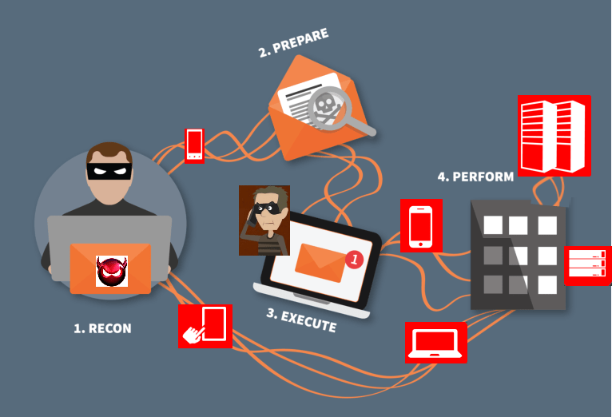
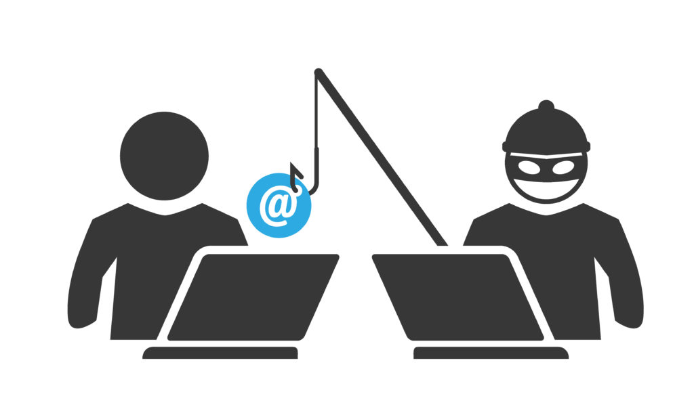
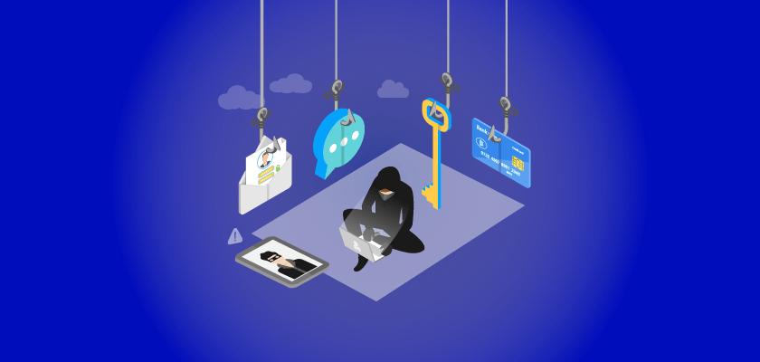
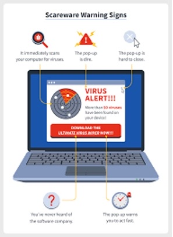
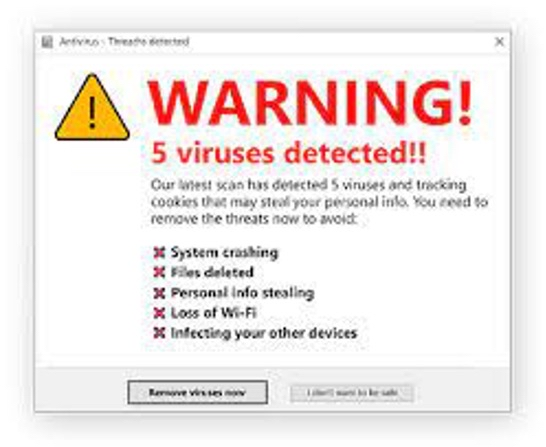
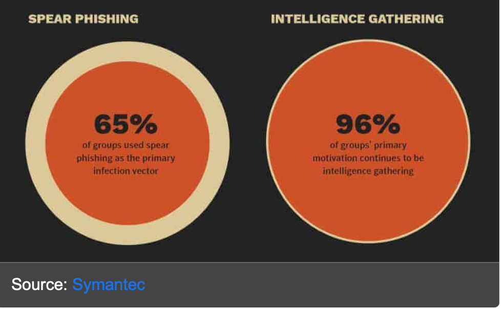
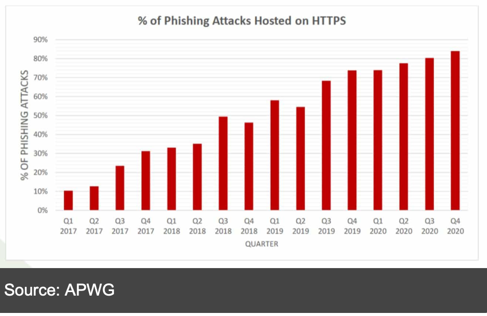
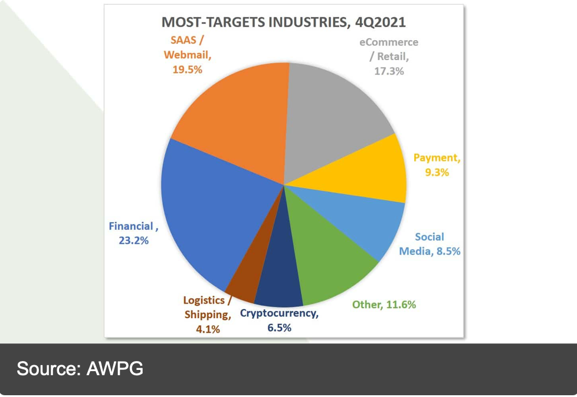
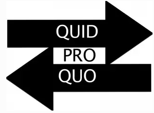

```{r setup, include=FALSE}
knitr::opts_chunk$set(echo = TRUE)
```

### Pretexting – Jocelyn Morales 

#### Introduction

1. Pretexting is one of the different types of social engineering attacks. It is formulated by an attacker staging a situation that requires an individual to share their private information. An example of this could be a fraud call, where a fraudster pretends to be a governing figure or someone from a bank and begins reaching out to victims, who are then tricked into giving out their personal details. Majority of the times, this data is used in malicious ways. 

#### Content  

1. What are the most common dialogues/templates used when pretexting a victim? 

*   The most common dialogue used when a hacker is attempting to pretext a victim, is by masking themselves as a bank that needs information from the user to verify a transaction. Where the victim sends their personal data, and the hacker extorts that.  

2. How to notice when a message or call is malignant. 

*   To identify a malignant call, look for signs of command repetitions if the caller keeps using the same words and attempting to gain some sort of information, you should hang up.  

3. How are targets chosen.  

*   Targets are chosen when they have access to certain data the hacker needs or wants. At times individuals can be chosen at random when a perpetrator comes across their phone number.  

```{r, echo=FALSE, fig.align='center'}



```


#### Conclusion

    Your bank account has been targeted and you need to provide certain details, so the problem can be eradicated. One of the many dialogues used by hackers to fish out information from their targets. Victims are placed in a vulnerable position; the majority does not think twice about verifying the validity of the statement and are quick to provide what is demanded of them. Pretexting has become the easiest and most common tactic used by hackers, because terribly it is extremely effective. Hence, we must adhere to authenticating any alert we might receive that requires giving out personal information. Educating ourselves will be the only way we can remain secure amongst the rapid growth of social engineering attacks.  

#### Sources

* [Social engineering attack examples, templates, and scenarios](https://www.sciencedirect.com/science/article/abs/pii/S0167404816300268)
* [OmeTV Pretexting Phishing Attacks: A Case Study of Social Engineering](https://ieeexplore.ieee.org/document/9924801/;jsessionid=9rHQmzVmKmQBk4UYlcPppBek2w_Vwa0LKh0F_XpEq4A7_DlFDcrK!-2038615898)
* [Social Engineering: The Looming Threat](https://ieeexplore.ieee.org/abstract/document/9491884)

-----

### Baiting – Diana Maldonado Luberto 

#### Introduction   

    Baiting is one of many forms of social engineering that is found now a days. It is typically an attack where scammers tend to use false promises to trap their victim and later steal their personal / financial information. There are many examples of forms of baiting but one of the most common ones this century is sending fake gift links to either a phone number or an email telling you to claim the gift through inserting personal or financial information. Allowing the scammer to take all your information without receiving any false gift. 

#### Content   

1. Who do they mainly attack? 

2. What is the main promotion maybe? 

3. What are possible ways to not fall under baiting? 

#### Conclusion  

    Overall social engineering builds up about 98% of the cyber-attacks world-wide basically meaning that all. That is going on is because of social engineering. Baiting included in that, us as young adults need to be careful with what links we open and what information we give out for a simple prize. Being more cautious  can stop the steal of personal and financial information. 

```{r, echo=FALSE, fig.align='center'}



```

#### Sources

* [Privacy Sense.net: Baiting](https://www.privacysense.net/terms/baiting/)
* [Don't Take the Bait! Phishing and Other Social Engineering Attacks](https://www.cyber.nj.gov/informational-report/dont-take-the-bait-phishing-and-other-social-engineering-attacks)
* [What is Baiting in Cybersecurity? Techniques, Examples, Protection](https://easydmarc.com/blog/what-is-baiting-in-cybersecurity-techniques-examples-protection/)

-----

### Scareware – Annabel Mejia Cortes  

#### Introduction

    Scareware is a form of social engineering where the technique used is to give people viruses by creating pop-ups, that sometimes resemble the format that the device uses, to instill fear in the user to encourage them to click the link. The pop-up virus commonly warns the user of a virus being installed on the device and directs them to get a protection service that ends up being the virus. There are many other forms of scareware tactics, but they all revolve around fear. 

#### Content   

1. Different methods of scareware tactics  

* Pop-ups disguised as protection plans
* Ads shown on trusted websites
* Pop-ups telling you there have been viruses detected on your device
  + They can look very real when they are custom made to look like the software you are using.
  + Note that an advertisement doesn't scan for viruses without you allowing them. 
  
2. How to identify scareware tactics

* Check the URL as often they will use a very similar URL to that of a legitimate website
* Unfamiliar company name
* Urgency from the pop-up
* Difficult to find the 'x' button to discard the pop-up
* Starts with "Warning!" or Virus deteced!

```{r, echo=FALSE, fig.align='center'}


```

#### Conclusion   

    This form of cyber-attack is still very prominent in our current society, and with technology being common attackers can take advantage of the fact that more people are aware that they need to have protection when going into sketchy websites. Scareware is something to look for when using the internet, but by being informed on what to look for, cyber-attacks won’t have to be as much of an issue. 

#### Sources

* []()
* []()
* []()

------

### Phishing – Carmen Lopez  

#### Introduction   

    Phishing is the act of sending messages, emails, letters, ect. In a way to pass of as a reputable company. The people who create phishing messages do it with the sole purpose of being able to steal personal information through the simple click of a button. Phishing has been going around for many years, year after year hundreds of people fall victim to a phishing message. Though as time passes by, people have been able to avoid these fraudulent messages, the attackers become more creative once they realize that old tactics are not working anymore. These attacks have gotten very popular within the hacking community that often it gets announced on Different news sites to be aware of what is going on and even give tips on how to be able to prevent it from happening to everyone. 

#### Content  

1. What are the main reasons hackers choose phishing as a way to attack? 

2. Who are the most targeted? 

3. How much has Phishing grown in the USA? 

```{r, echo=FALSE, fig.align='center'}



```

#### Conclusion  

    Years continue to go by, and phishing will also continue to grow as the attackers tend to get more and more creative as well. Constantly finding a new way to get someone to click their link, whether that is through a “lost package” message or through “Official concert ticket” emails. It might seem easy to be able to avoid these kinds of scams but sometimes the messages can just be very tempting. Though, there are many different security systems that people can use in order to stop this information leakage even when you click on the link. 

#### Sources

* [ScienceDirect: Phishing-challenges and solutions](https://www.sciencedirect.com/science/article/abs/pii/S1361372318300071)
* [Confense: History of Phishing](https://cofense.com/knowledge-center/history-of-phishing/)
* [CSUSB ScholarWorks: A Study of Social Engineering Concepts Within A Deceptive Defense](https://scholarworks.lib.csusb.edu/cgi/viewcontent.cgi?article=2659&context=etd)

------

### Quid Pro Quo – Austin Mercado  

#### Introduction 

    From the various ways of social engineering, one of the infamous styles that wrecks much havoc across the globe is Quid Pro Quo. Quid Pro Quo occurs across long distances in close doors to in door share offices among colleagues. Quid Pro Quo is a Latin phrase that phases to exchange of goods or services. However often enough, thieves will promise their share to gain access to goods and valuables before the other party realizes its to late. Often enough on the web, it comes to that situation where fault situations that appear to be drastic; creating the trap environment and luring in the victim environment to put their guard down to take advantage of the individual. 

#### Content 

1. Early Signs of Quid Pro Quo:
* Bad Gut feeling  
+ Feeling of "too good to be true"

2. Ways to avoid Quid Pro Quo:
* Request help from someone close or second opinion before engaging a possible Quid Pro Quo.
* Request contact information or stall till confirmation 
* Look into it before following the instructions
+ Look at the fine lining 

```{r, echo=FALSE, fig.align='center'}


```


#### Conclusion

1. More than ever, social engineer attacks have been at their highest more than ever. Quid Pro Quo is a potential dangerous trade that results in millions of dollars of value stolen. In addition, the development of further trouble ahead in life that comes to affect many in the long run. The best way to avoid harm to oneself or another is acknowledge1qxx the problem and make awareness of the scheme of Quid Pro Quo that has developed in this world. 

#### Sources

* [ScienceDirect: Overview of Social Engineering Attacks on Social Networks](https://scholarworks.lib.csusb.edu/cgi/viewcontent.cgi?article=2659&context=etd)
* [AIS eLibrary: A Taxonomy for Social Engineering attacks](https://aisel.aisnet.org/confirm2011/15/)
* [International Journal on Advances in Engineering, Technology and Science, Protection of Computer Networks from the SOcial Engineering Attacks](https://ijaets.in/articles/1-1/1510001.pdf)